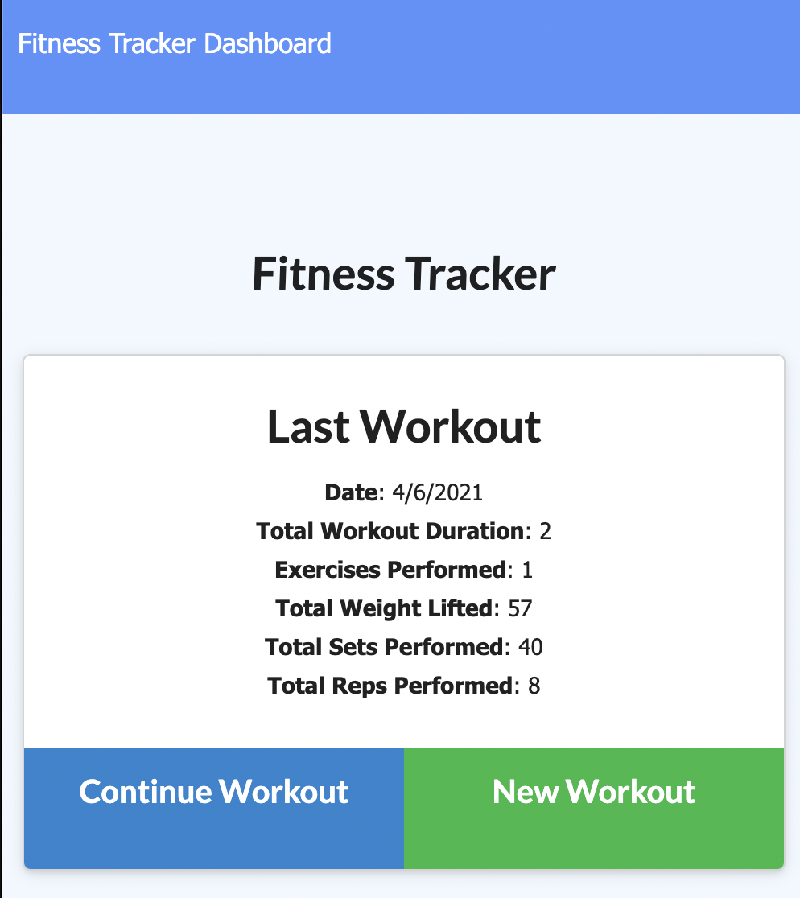

# workout-tracker

## About

This full stack application allows the user to enter details about exercises in their workout sessions, and then view aggregate data of their efforts.

## Table of Contents

- [Files](#Files)
- [Usage](#Usage)
- [Future Development](#Future_Development)
- [Contributions](#Contributions)
- [Testing](#Testing)
- [Credits](#Credits)
- [License](#License)
- [Contact](#Contact)

## Files

- models
  - workout.js
- public
  - api.js
  - exercise.html
  - exercise.js
  - index.html
  - index.js
  - stats.html
  - stats.js
  - style.css
  - workout.js
- routes
  - api-routes.js
  - html-routes.js
- seederss
  - seed.js
- LICENSE
- package.json
- README.md
- server.js

## Usage

Deployed project can be found at [workout-tracker](https://w0rk0ut-tr4cker.herokuapp.com/)

Upon loading the app, the user can see the details of their last workout, and choose whether to add an exercise to that work out, or begin a new one. They than can choose the type of workout, resitance or cardio, and enter relevant details: name, distance, duration, weight, sets, and reps. The data is then saved by selecting either adding another exercise, or completing the workout and returning to the landing page. By viewing the stats page the user can see the total weight from exercises and total duration for each of the last 7 workout sessions.

## Future_Development

Added usefulness could come from improving what data is being displayed on the stats page. The current pie and donut charts display a misleading and false cross section of data sets.

## Contributions

Contributions can be made by forking the repository on gitHub and submitting a pull request.

The repository can be found at [workout-tracker](https://github.com/jacob-af/workout-tracker)

## Testing

No testing suites were used in this project.

## Credits

Back end development and deployment was done by Jacob A Feitler, front end source code was provided.

## License:

This project is licensed under the MIT license, copyright 2021

## Contact

You can view my GitHub profile at [github.com/jacob-af](https://github.com/jacob-af)
